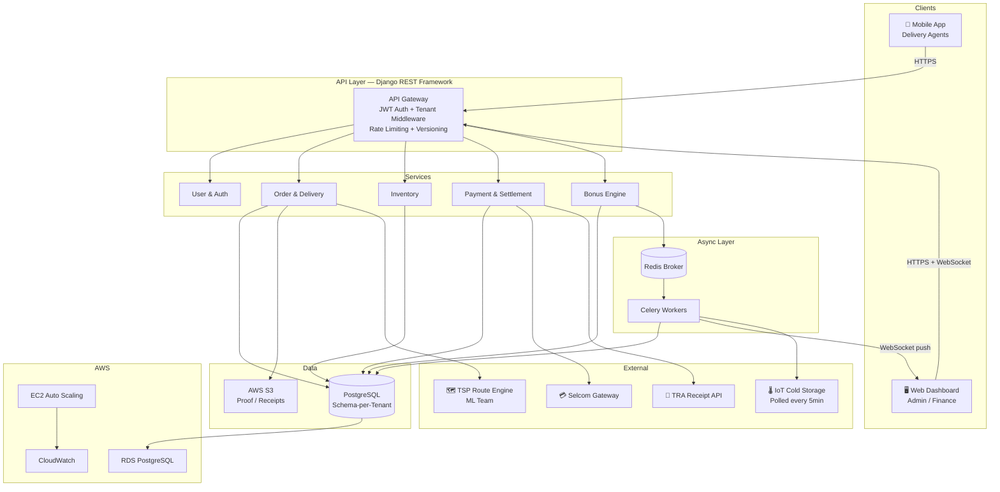
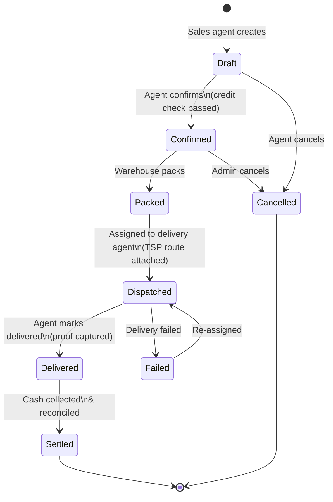
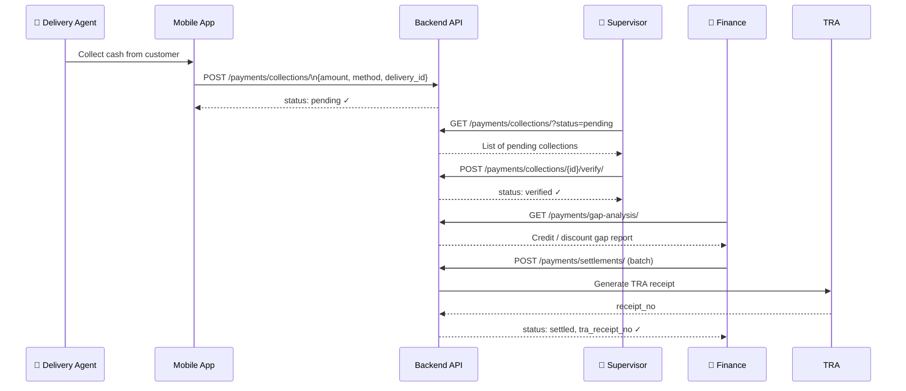
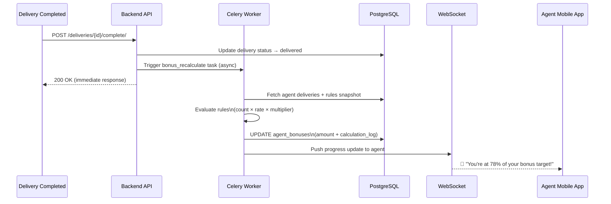
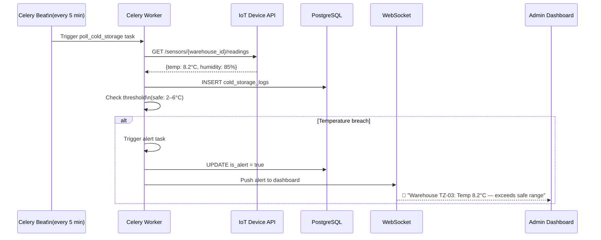
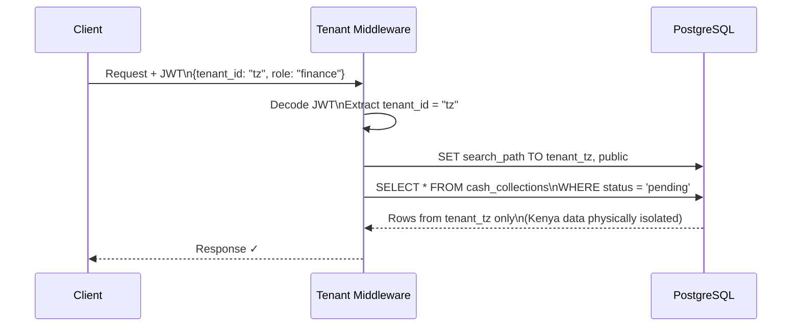
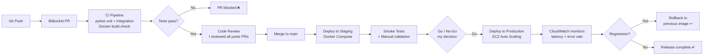

# 🗺️ Architecture Diagrams

All diagrams use [Mermaid](https://mermaid.js.org/) — they render natively on GitHub. Paste into [mermaid.live](https://mermaid.live) to view locally.

---

## 1. High-Level System Architecture

---

## 2. Order Lifecycle State Machine

---

## 3. Cash Collection & Settlement Workflow
*(Designed end-to-end by me)*

---

## 4. Bonus Calculation Engine Flow
*(Designed end-to-end by me)*

---

## 5. IoT Cold Storage Polling Architecture

---

## 6. Multi-Tenant Request Flow

---

## 7. CI/CD & Deployment Pipeline

